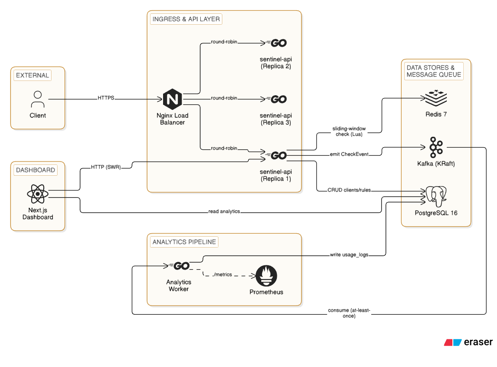

# Sentinel — Distributed Rate-Limiting Platform

A distributed rate-limiting platform built in Go with a Kafka analytics pipeline and a Next.js dashboard. **Hackathon submission.**

## What it does

Sentinel is a **distributed rate-limit check service** — it is **not a proxy**. Your API gateway or application calls Sentinel's `POST /v1/check` endpoint to ask: *"is this client allowed to hit this endpoint right now?"* Sentinel answers `{allowed: true/false, remaining}` against a Redis sliding-window counter, and streams every check event asynchronously through Kafka for analytics. Your service decides what to do with the answer — allow, reject, queue, throttle.
```pseudocode
# In Client
if sentinel.check("client_id", "endpoint").allowed == true {
    // allow request    
} else {
    // reject request
    // return retry_after from the response
}
```

### API at a glance

| Method | Path | Purpose |
|--------|------|---------|
| `POST` | `/clients` | Register a service (returns `client_id`) |
| `POST` | `/rules` | Create a rate-limit rule (e.g. 100 req / 60 s) |
| `POST` | `/v1/check` | Check if request is under limit → `{allowed, remaining}` |
| `GET` | `/analytics/usage` | Time-bucketed allowed/rejected counts |
| `GET` | `/analytics/latency` | P50/P99 latency over time |

```bash
# Quick interactive demo
client_id=$(curl -s -X POST http://localhost:8080/clients \
  -H 'Content-Type: application/json' \
  -d '{"name":"demo"}' | jq -r '.client_id')
# → curl POST /rules with $client_id, then curl POST /v1/check
```

### Key design properties

- **Sub-ms decisions** — Redis Lua script atomically prunes, counts, and inserts in a single round-trip; no race conditions between replicas.
- **Always async analytics** — check events fan out to Kafka via a non-blocking channel; the worker batch-inserts into PostgreSQL. Dropped events under backpressure never slow the hot path.
- **Graceful degradation** — RedisDown → Postgres limiter → FailOpen. Traffic always flows.
- **Stateless API replicas** — Nginx round-robins across 3 Go servers; all state lives in Redis/Postgres.
- **Dashboard** — Next.js 16 with SWR, Recharts, shadcn/ui. Shows live usage, latency, and degradation state.

## Prerequisites

- [Docker](https://docs.docker.com/get-docker/) & Docker Compose (v2.30+)
- [Go](https://go.dev/dl/) 1.25+ (for running tests outside Docker)
- [Node.js](https://nodejs.org/) 20+ (for the dashboard, if running standalone)

## Quick start (judges — run this first)

Install dependencies first:

```bash
# Copy environment file
cp .env.example .env

# Install Go dependencies
go mod download

# Install dashboard dependencies
cd sentinel-dashboard && npm install && cd ..

# macOS: make is pre-installed
# Linux: sudo apt install make      (Debian/Ubuntu)
#         sudo dnf install make      (Fedora)
# Windows: choco install make       (Chocolatey)
```

```bash
make docker-run        # Full stack: Postgres, Redis, Kafka, API, Dashboard
```
> No `make`? → `docker compose up --build --scale sentinel-api=3`

| Service       | URL                     |
|---------------|-------------------------|
| **API**       | `http://localhost:8080` |
| **Dashboard** | `http://localhost:3000` |

To test once it's running:

```bash
make test              # Unit tests (no Docker)
make e2e-script        # E2E smoke test (needs docker-run first)
make loadtest          # k6 load test + web dashboard at :5660 + results at ./loadtest/results.html
```
> No `make`? → 
```bash
go test -race ./... -v                         # Unit tests (no Docker)
bash scripts/e2e.sh                            # E2E smoke test (needs docker-run first)
docker compose --profile loadtest up k6        # k6 load test + web dashboard at :5660 + results at ./loadtest/results.html
```

## Architecture

<picture>
  <source media="(prefers-color-scheme: dark)" srcset="docs/architecture-diagram-dark.png">
  
</picture>

### Data flow: rate-limit check (`POST /v1/check`)

A single rate-limit check request passes through six distinct stages. Here is the journey, start to finish — the trigger, the mechanism, and what emerges.

---

#### Stage 1 — Arrival (Client → Nginx)

**Trigger.** An API client sends `POST /v1/check` with its `client_id` and the API endpoint path (`api`) it wants to rate-limit.

**Mechanism.** The request lands on Nginx, the edge load balancer. Nginx terminates the TLS session, parses the HTTP method and path, and selects a backend replica.

**Output.** A clean HTTP request is forwarded to one of three stateless `sentinel-api` replicas over a plain-text internal connection. The client's identity (`client_id`) and the target resource (`api`) are preserved as the request body — unchanged, already validated for structure but not yet for rate limits.

```
POST /v1/check
body: { "client_id": "c_abc123", "api": "/v1/weather" }
```

---

#### Stage 2 — Decision (sentinel-api → Redis)

**Trigger.** The API replica receives the proxied request. It looks up the client's configured rule (fetched from PostgreSQL and cached in Redis with a configurable TTL). If the rule is stale or missing, it falls back to Postgres — but >90% of the time the cache hits.

**Mechanism.** The replica runs an embedded Lua script against Redis via `EVALSHA`. The script does three things inside one atomic Redis call:

1. **Prune** — `ZREMRANGEBYSCORE` removes any timestamps older than the sliding window (e.g. entries older than 60 s).
2. **Count** — `ZCARD` counts the remaining entries in the sorted set.
3. **Write** — If the count is below the limit, `ZADD` inserts the current timestamp; if at the limit, it does nothing — the window is full.

Because Lua runs atomically in Redis, there are no race conditions between replicas. Two concurrent requests from the same client cannot both slip past the limit.

**Output.** The Lua script returns a JSON-like response:

| Scenario | Response |
|----------|----------|
| ✅ Under limit | `{ "allowed": true, "remaining": 87 }` — proceed. |
| ❌ At limit | `{ "allowed": false, "retry_after": 42 }` — the oldest entry expires in 42 s. |

The replica sends this directly back to the client through Nginx. The synchronous path is done in a few milliseconds.

---

#### Stage 3 — Audit trail (sentinel-api → Kafka)

**Trigger.** Immediately after responding — while the HTTP handler is still finishing its write — the replica enqueues a `CheckEvent` onto a buffered Go channel. This is a non-blocking send: if the channel is full (backpressure), the event is dropped rather than slowing the request.

**Mechanism.** A background goroutine drains the channel and publishes each event to the `check_events` topic in Kafka (KRaft mode, no ZooKeeper dependency). Each event is a protobuf-serialised message containing:

- `client_id` — who made the request
- `api` — which endpoint was checked
- `allowed` — whether the request passed
- `timestamp` — when the check happened
- `latency_us` — how long the Redis Lua call took (microseconds)
- `node_id` — which API replica served the request

**Output.** The message lands in a Kafka partition, durably stored and replicated. The client has already received their response — they have no idea this stage even happened. That is by design: rate limiting never blocks on observability.

```
Topic: check_events
Partition: 2  Offset: 1403
Value: { client_id: "c_abc123", api: "/v1/weather", allowed: true, ... }
```

---

#### Stage 4 — Consumption (Kafka → Analytics Worker)

**Trigger.** The Analytics Worker, a long-running Go process, polls Kafka in a consumer group. When a new message arrives in its assigned partition, the worker's `FetchMessage` call returns.

**Mechanism.** The worker decodes the protobuf envelope, then runs a transformation pipeline:

1. **Deserialise** the `CheckEvent` from the wire format.
2. **Resolve** the event's `client_id` to a human-readable client name via a cached lookup.
3. **Compute** the time bucket for analytics aggregation (e.g. the minute-aligned timestamp `2026-07-19T14:42:00Z`).
4. **Prepare** an `INSERT` statement that maps the event onto the relational schema.

If the decode or insert fails, the worker uses exponential backoff (100 ms → 200 ms → 400 ms … up to 30 s) and retries before committing the offset — guaranteeing at-least-once delivery.

**Output.** A structured row ready for PostgreSQL, queued in the worker's internal batch buffer (up to 500 rows or 1 s, whichever comes first).

---

#### Stage 5 — Persistence (Analytics Worker → PostgreSQL)

**Trigger.** The batch buffer reaches its threshold (500 rows or 1 s of inactivity). The worker opens a `COPY` stream to PostgreSQL — the fastest way to bulk-insert in Postgres.

**Mechanism.** The worker writes every buffered row into the `usage_logs` table in a single round-trip. The schema is designed for time-bucketed analytics queries:

```sql
INSERT INTO usage_logs (bucket, client_id, api, allowed, rejected, p50_latency, p99_latency, total_requests)
VALUES ($1, $2, $3, $4, $5, $6, $7, $8)
ON CONFLICT (bucket, client_id, api) DO UPDATE SET
  allowed = usage_logs.allowed + EXCLUDED.allowed,
  total_requests = usage_logs.total_requests + EXCLUDED.total_requests;
```

An `UPSERT` per bucket means the dashboard can query pre-aggregated rows instead of scanning millions of individual events.

**Output.** Milliseconds after the worker consumed the Kafka message, the data is queryable in Postgres. The dashboard can now see it.

---

#### Stage 6 — Visualisation (Dashboard → API → PostgreSQL)

**Trigger.** A user opens the Sentinel dashboard at `http://localhost:3000`. The dashboard's frontend (Next.js 16 with SWR for stale-while-revalidate caching) fires `GET /analytics/usage` and `GET /analytics/latency`.

**Mechanism.** The API server receives the analytics request and runs a time-bucketed aggregation query against PostgreSQL:

```sql
SELECT bucket, SUM(allowed) AS allowed, SUM(rejected) AS rejected,
       AVG(p50_latency) AS avg_latency
FROM usage_logs
WHERE bucket >= NOW() - INTERVAL '1 hour'
GROUP BY bucket
ORDER BY bucket;
```

The result set is a series of (bucket, allowed, rejected, latency) tuples — typically 60 rows for the last hour (one per minute). The API serialises them as JSON and returns them to the dashboard.

**Output.** The dashboard's Recharts area chart renders two stacked series: green `allowed` requests rising from zero, red `rejected` requests stacked on top. A line overlay shows P50 and P99 latency. The data updates every 10 seconds via SWR's automatic revalidation.

```
    ▲ requests
 120 │  ████████▌
  90 │  ████████████▌           ██████████▌
  60 │  ████████████████▌  ████████████████████▌
  30 │  ████████████████████████████████████████▌
   0 └───────────────────────────────────────────► time
      ██ allowed  ██ rejected  ─ P50  ─ P99
```

The entire journey — from client request to pixels on a dashboard — completes in under 50 ms for the synchronous path, with the async analytics lagging by at most a few seconds.

### Degradation ladder

| State | Primary path | Fallback | Traffic effect |
|-------|-------------|----------|----------------|
| 🟢 Normal | Redis Lua script | — | Sub-ms decisions |
| 🟠 RedisDown | PostgreSQL query | Postgres limiter | Slower but still rate-limited |
| 🔴 FailOpen | — | Allow all | No rate limiting; Prometheus alert fires |

## Other useful commands

### `make build` — Build the API server binary

```bash
make build   # → produces ./main
```

Fallback: `go build -o main cmd/api/main.go`

### `make run` — Run the API server locally (outside Docker)

```bash
make run
```

Fallback: `go run cmd/api/main.go`

Requires Postgres, Redis, and Kafka running (use `make docker-run` for those).

### `make test` — Run all unit tests

```bash
make test
```

Fallback: `go test -race ./... -v`

Fast, Redis-free tests (uses `miniredis`). No Docker needed.

### `make itest` — Run integration tests (needs Docker)

```bash
make itest
```

Fallback: `go test ./internal/database -v`

Spins up Postgres via `testcontainers-go`. Docker required.

### `make watch` — Live reload

```bash
make watch
```

Uses [`air`](https://github.com/air-verse/air). If not installed, the Makefile offers to install it automatically.

### `make clean` — Remove the built binary

```bash
make clean   # rm -f main
```

### `make e2e-script` — E2E smoke test (requires `make docker-run` first)

```bash
make e2e-script
```

Runs `scripts/e2e.sh` — a curl-based smoke test against the running stack.

### `make loadtest` — k6 load test with web dashboard

```bash
make loadtest
```

Boots a k6 container that runs `loadtest/scenario.js`. View the real-time dashboard at `http://localhost:5660`. Requires `make docker-run` first.

## Dashboard (standalone)

The dashboard lives in `sentinel-dashboard/`. To run it independently of Docker:

```bash
cd sentinel-dashboard
npm install
npm run dev       # → http://localhost:3000
```

Other dashboard commands:

| Command            | What it does                |
|--------------------|-----------------------------|
| `npm run build`    | Next.js production build    |
| `npm run test`     | Vitest unit tests           |
| `npm run lint`     | ESLint                      |
